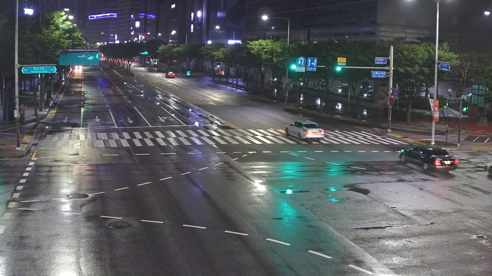
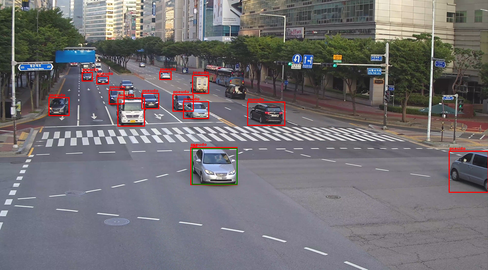
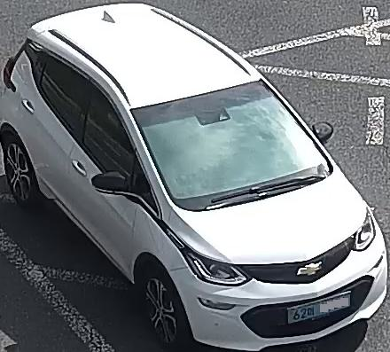
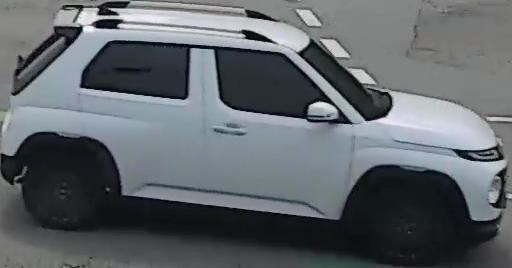
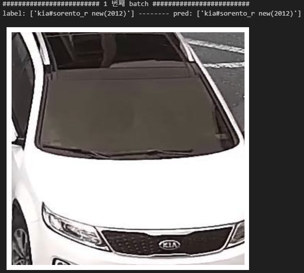
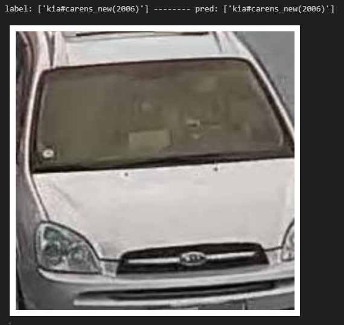
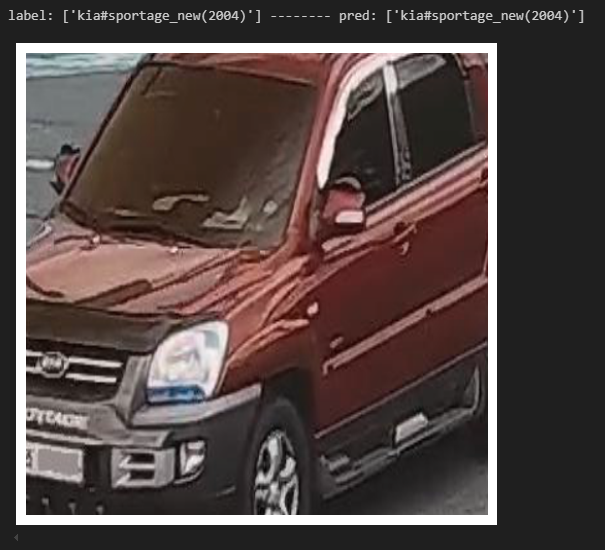

# Fine-grained recognition (car class)

## 
Model flow

    Input image -> train YOLOv5s(detection) -> pseudo labeling  
                                                        ㄴ> retrain Yolov5s -> image crop -> TransFG -> Prediction

### 원본 이미지   
   

### pseudo label 적용 이미지 & annotation
초록 bbox annotation이 원래의 bbox annotation  
빨강 bbox annotation이 pseudo label 적용한 bbox annotation

### image crop

  
  

### Results

 
  
  
  

 

